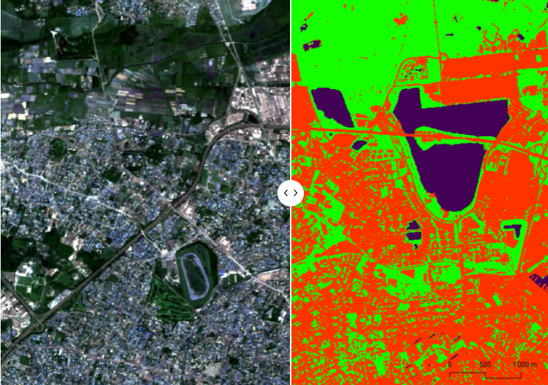

# MachineLearning : Model prefictif >Random Forest pour une Carte d'occupation du sol avec les données Sentinel 2
En savoir plus : https://geoafrica.fr/data-science-carte-doccupation-des-sols-2018avec-sentinelle-2/

  

